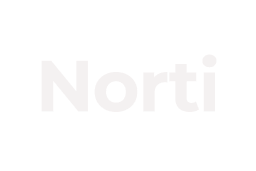
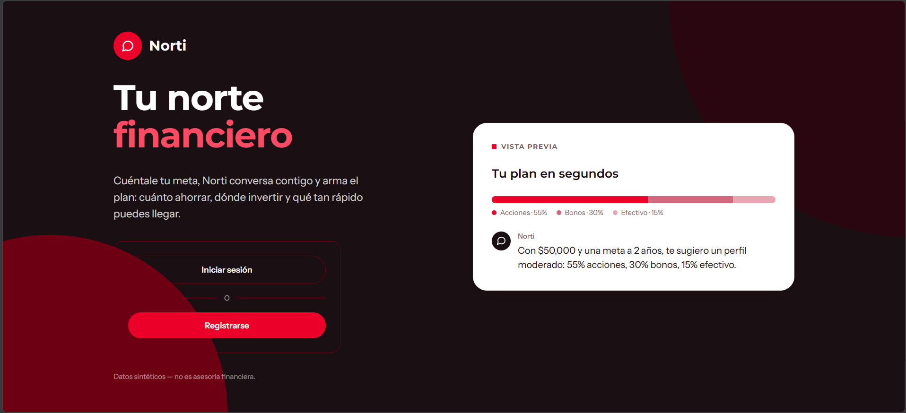
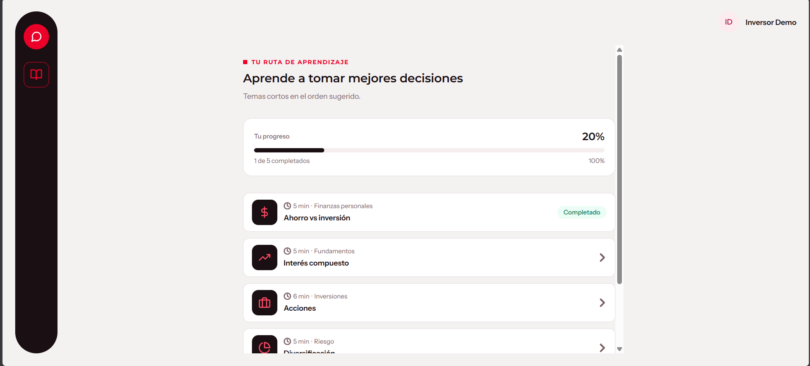
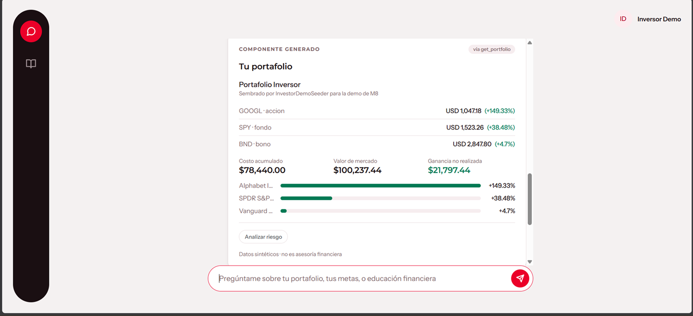

<p align="center">
  
</p>

**Financial intelligence and education, powered by AI and MCP.**

Norti started with a simple question:

> What if making a financial decision wasn't just about knowing what is happening in the market, but also understanding how it relates to your own situation?

During HackMTY 2026, we set out to build a financial assistant that could connect a person's financial context — their goals, portfolio and assets — with real market information and financial education.

What we ended up building was something a little different.

Norti became an experiment in how an AI agent can interact with financial capabilities through the **Model Context Protocol (MCP)**, while keeping business logic, permissions and data access under the control of the application.

The result is a financial platform where the AI does not directly access the database or decide how financial operations are executed. Instead, it discovers and uses explicit capabilities exposed through MCP, and those capabilities return structured information that can become dynamic user interfaces through **A2UI**.

```text
User → AI Agent → MCP → Financial capabilities → A2UI → Interface
```

All user data in the demo is synthetic. Norti does not connect to real banking accounts, execute trades or provide regulated financial advice.

<p align="center">
  
</p>

## Why Norti?

Financial decisions are rarely made from a single piece of information.

A market quote tells you what an asset is worth. A portfolio tells you what you already own. A financial goal tells you what you are trying to achieve. Your financial profile provides context. Education determines whether you actually understand the decision you are making.

We wanted to bring those pieces together.

Norti combines:

- Financial profiles and goals
- Portfolios and holdings
- Asset information
- Real market data through Twelve Data
- Financial analysis and simulations
- Financial education and learning progress
- An AI agent capable of discovering and using these capabilities

The goal is not simply to answer:

> “What should I invest in?”

It is to provide enough context for a person to understand what is happening, why it matters, and what they should consider before making a decision.

<p align="center">
  
</p>

## What we built

The final Norti prototype is organized around three ideas:

**Financial domain.**  
Norti has its own financial domain with profiles, goals, portfolios, holdings, assets and financial services rather than relying exclusively on an external market-data API.

**MCP as the interface between AI and the application.**  
The agent interacts with the system through explicit MCP tools. Tools validate permissions and delegate the actual work to application services instead of containing financial logic themselves.

**Education as part of the experience.**  
Financial information is not isolated from learning. Norti exposes educational topics, learning paths and progress alongside its financial capabilities.

This resulted in an MCP server with 11 tools covering financial information, market data, analysis, simulations and education.

### MCP tools

| Tool | Scope |
|---|---|
| `get_financial_profile` | `mcp:read` |
| `get_financial_goals` | `mcp:read` |
| `get_portfolio` | `mcp:read` |
| `analyze_portfolio` | `mcp:read` |
| `get_asset_information` | `mcp:read` |
| `get_market_snapshot` | `mcp:read` |
| `get_educational_topic` | `mcp:read` |
| `get_learning_path` | `mcp:read` |
| `get_learning_progress` | `mcp:read` |
| `simulate_investment` | `mcp:simulate` |
| `mark_topic_completed` | `mcp:write` |

Some capabilities were deliberately left outside the MVP:

`execute_trade`, `transfer_money`, and `withdraw_funds`.

Norti is designed to demonstrate financial intelligence and education, not to operate as a real banking or trading system.

## From agent to interface

One of the things that changed the most during the hackathon was our idea of what the AI interface should look like.

We initially thought primarily in terms of conversation: ask a question, call a capability, receive an answer.

As the project evolved, we introduced **A2UI**.

Instead of returning only text, MCP tools can return a structured response describing a semantic UI component and its properties.

<p align="center">
  
</p>

The agent can select the appropriate component, while the Blade view remains responsible for deciding how that component is rendered.

```text
User
  ↓
AI Agent
  ↓
MCP Tool
  ↓
Application Service
  ↓
Structured result
  ↓
A2UI component + props
  ↓
Blade component
```

This allowed us to keep the intelligence and business logic separate from the presentation layer while still making the interaction feel more like an application than a traditional chatbot.

## Architecture

At the core of Norti is a simple separation of responsibilities:

```text
MCP Tool
    ↓
Application Service
    ↓
Domain / Business Logic
    ↓
Models
    ↓
Database / External Provider
```

Tools do not contain financial logic. They validate their required scope, call an application service and return a structured response.

The main application layers are:

```text
app/Mcp/                         MCP server and tools
app/Services/                   Domain services, contracts and adapters
app/Ai/                         AI agent and tool-result handling
app/Http/Controllers/           Authentication, onboarding, chat and education
resources/views/components/a2ui/ A2UI components
docs/                            Architecture, decisions and development notes
```

This separation also makes external providers replaceable. Market data is accessed through `MarketDataProviderContract`, with Twelve Data as the current implementation.

```text
MarketDataProviderContract
          ↓
  TwelveDataProvider
          ↓
   TwelveDataClient
          ↓
      Twelve Data
```

The AI provider follows the same principle. Norti currently uses OpenAI through Laravel AI, while the agent is designed so the model provider can be overridden.

## Security by design

Because Norti works with financial information, even synthetic data in a hackathon prototype, we wanted the AI layer to operate through controlled capabilities rather than unrestricted application access.

The MCP layer includes:

- Scope validation for individual tools
- API authentication for the MCP endpoint
- Rate limiting
- Audit logging of tool calls
- Controlled detail levels for sensitive financial information
- Separate authentication flows for the human application and the AI agent

For example, financial profile and goal tools return summarized information by default, while exact amounts require an explicit detail level.

Audit logs store metadata about tool calls without storing exact financial amounts.

## Technology

- PHP 8.4 / Laravel 13
- PostgreSQL with Supabase
- SQLite for fast local development
- Laravel MCP
- Laravel AI
- OpenAI
- Anthropic support through the AI provider abstraction
- Blade, Vite and Tailwind CSS 4
- Twelve Data
- Laravel Passport
- PHPUnit
- GitHub Actions

## Running Norti locally

### Requirements

PHP 8.3+, Composer and Node.js 20+.

```bash
composer setup
php artisan passport:keys
php artisan passport:client --personal --name="Norti"
```

For Windows environments without the `sodium` extension:

```bash
composer install --ignore-platform-req=ext-sodium
```

Configure the relevant variables in `.env`:

```env
DB_*
TWELVE_DATA_API_KEY=
OPENAI_API_KEY=
ANTHROPIC_API_KEY=
MCP_RATE_LIMIT_PER_MINUTE=
MCP_LOOPBACK_URL=
```

Then start the application:

```bash
composer dev
```

Seed the demo environment:

```bash
php artisan db:seed --class=Database\\Seeders\\DemoSeeder
```

The demo seeder creates the local demo account.

### MCP development server

The `/chat` flow uses an HTTP loopback to the MCP endpoint. When using a single-threaded `php artisan serve` process, the application can block while waiting for its own request.

Run the MCP endpoint separately:

```bash
php artisan serve --port=8001
```

Then point the main application to it:

```bash
MCP_LOOPBACK_URL=http://localhost:8001 php artisan serve
```

### Testing MCP directly

The MCP layer can also be tested without the frontend:

```bash
php artisan mcp:inspector /mcp/banorte
php artisan mcp:client-tools
php artisan mcp:client-call get_market_snapshot --arguments='{"symbols":["AAPL"]}'
php artisan mcp:demo-agent "¿Cuál es la cotización de AAPL?"
```

The last command runs the actual agent and allows the model to select the appropriate MCP tool.

### Tests

```bash
composer test
vendor/bin/pint --test
```

Tests use `RefreshDatabase`; do not run them against a database containing real data.

## What we learned

Norti changed quite a bit between the idea we started with and the system we finished.

We started thinking about a financial assistant.

We ended up thinking much more about **how an AI system should interact with an application**.

MCP forced us to make the capabilities of our financial domain explicit. The agent could not simply “know” how our application worked; it had to discover what it could do.

Building the financial domain forced us to separate business logic from the AI layer.

Integrating real market data forced us to think about provider boundaries instead of coupling the entire application to one API.

And A2UI changed our understanding of the interface itself: an AI interaction does not necessarily have to end with a paragraph of generated text.

The hackathon therefore became less about building a chatbot and more about exploring a question that sits underneath Norti:

> **What happens when financial capabilities become tools that an AI agent can understand, combine and use — while the application still controls what the agent is allowed to do?**

That is the Norti we ended up building.

## Documentation

More detailed technical documentation is available in:

- [`docs/architecture/`](docs/architecture) — project scope, system architecture, domain model and A2UI contract
- [`docs/decisions/`](docs/decisions) — architecture decision records
- [`docs/development/`](docs/development) — roadmap, demo script, audit notes and development documentation
- [`CLAUDE.md`](CLAUDE.md) / [`AGENTS.md`](AGENTS.md) — context and guidelines for coding agents

## Out of scope

Norti does not currently provide:

- Real banking account integration
- Money transfers or payments
- Real trading or order execution
- Regulated financial advice
- Universal market coverage
- Production banking infrastructure

## Team

Built at **HackMTY 2026** for the **Banorte × Tec de Monterrey** challenge.

The project was developed across four workstreams:

- Financial domain and services: [RodrigoFQ7](https://github.com/rodrigofq7)
- MCP and infrastructure: [F3lix83](https://github.com/f3lix83)
- Market data and AI: [not-enough-tokens](https://github.com/not-enough-tokens)
- Financial education and product: [relative-string](https://github.com/relative-string)

Norti is a hackathon prototype, but the architecture was designed around a principle we wanted to take seriously from the beginning:

**AI should be able to use financial capabilities without being given unrestricted control over the system.**
